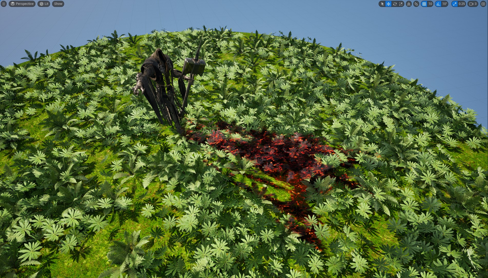
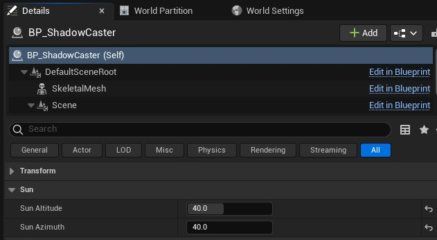
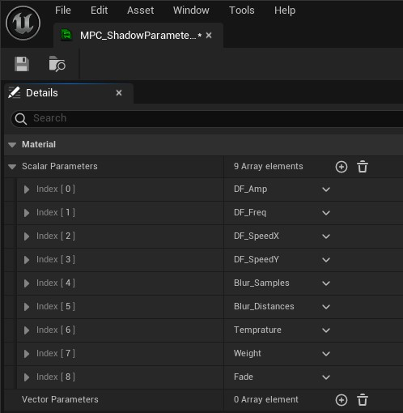
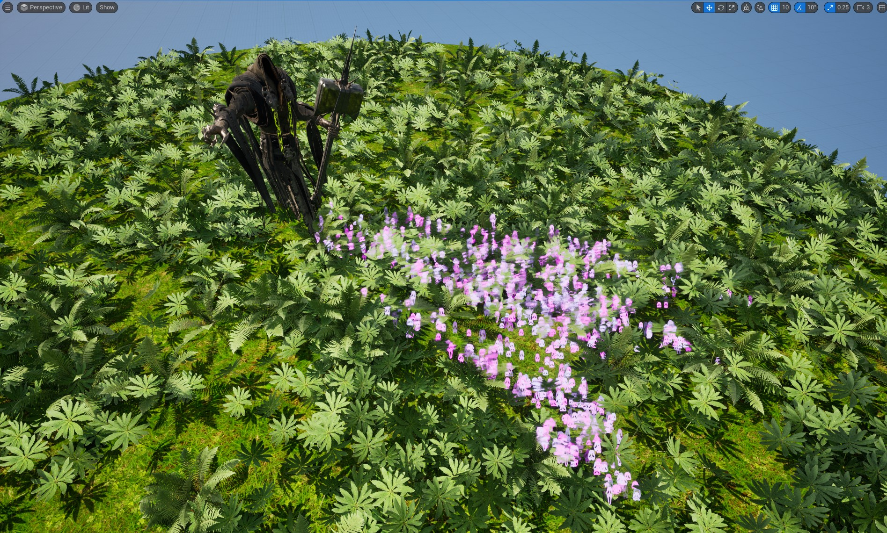
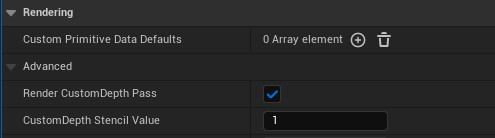

# ShadowMask

Calculating shadow area based on the MVP matrices in Shader and Niagara

## Shadow Parameters
Sun location parameters are in the BP_ShadowCaster > Sun category.

Shadow parameters for the shaders are accessible in Mats > MPC_ShadowParameters

## Niagara Particles

Niagara particles are spawned in the screenspace and then projected on the surfaces with CustomDepth Stencil Value 1.0

***
Megascans Grass Texture Link

[Clover Patches On Grass](https://quixel.com/megascans/home?search=clover&search=patches&search=on&search=grass&assetId=sgmkajak)

## Videos

